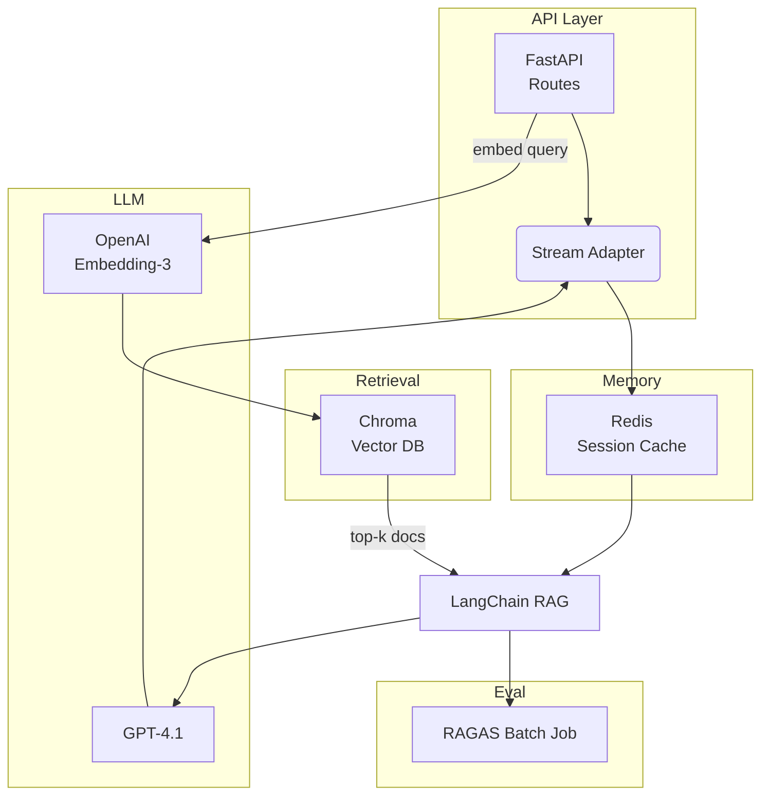

# 절세 RAG 챗봇 백엔드 중심 PRD

## 개요
이 문서는 기존 풀스택 PRD를 **Python 백엔드에서 구현해야 하는 내용**으로 축소한 것입니다: 공개 API, 세션 메모리, RAG 검색, OpenAI 오케스트레이션, 자동 평가. 모든 UI, DevOps 및 인프라 튜닝 세부사항은 의도적으로 생략되었습니다.

## 백엔드 핵심 기능

| ID | 기능 | 설명 | 중요한 이유 | 구현 방식 |
|----|---------|--------------|----------------|----------------------|
| BE-1 | REST & SSE API | `POST /chat`, `GET /history`, `POST /evaluate`, 서버 전송 스트리밍 | 웹/모바일 단일 통합 지점, 실시간 토큰 스트리밍 가능 | FastAPI async 엔드포인트 + Uvicorn |
| BE-2 | 세션 메모리 | 사용자별 단기 컨텍스트(≤ k턴) 저장 | 일관된 멀티턴 대화 가능, 토큰 비용 절약 | `ConversationBufferWindowMemory` → Redis (`RedisChatMessageHistory`) |
| BE-3 | 지식 검색 | 세법 문서 & FAQ에 대한 벡터 검색 | 권위 있는 텍스트 기반 답변, 헛소리 감소 | OpenAI Embedding-3-Large → Chroma 영구 클라이언트 |
| BE-4 | 답변 생성 | GPT-4.1이 인용과 함께 최종 응답 생성 | 검색된 컨텍스트 + 사용자 질의를 유용한 답변으로 변환 | LangChain `StuffDocumentsChain` |
| BE-5 | 세금 계산기 도구 | 종합과세 vs ISA/연금 시나리오 계산하는 결정론적 Python 모듈 | LLM이 인용할 수 있는 수치 결과 제공 | Pydantic I/O → 로컬 함수 호출 |
| BE-6 | RAG 평가 | RAGAS를 사용한 배치 평가 & CI 훅 | 지속적인 품질 메트릭(충실성, 컨텍스트 정밀도) | 일일 크론 & GitHub Actions |
| BE-7 | 관측 가능성 | 추적, 로그, 지연시간 히스토그램 | 디버깅 및 회귀 탐지 | LangSmith 추적 미들웨어 |

## 기술 아키텍처



### 구성 요소 스택
| 계층 | 기술 | 비고 |
|-------|------------|-------|
| 웹 서버 | FastAPI 0.111 / Uvicorn | async, SSL 업스트림 종료 |
| 메모리 저장소 | Redis 7 | 1 Gi RAM; TTL 30분; 클러스터 지원 |
| 벡터 DB | Chroma 0.5 영구 클라이언트 | DuckDB+Parquet; 야간 백업 |
| 임베딩 | `text-embedding-3-large` | 3072차원; 청크 크기 512 토큰 |
| LLM | GPT-4o-mini (개발), GPT-4.1 (운영) | temperature 0.2 |
| 오케스트레이션 | LangChain 0.2 | RunnableWithMessageHistory |
| 관측성 | LangSmith 0.3 + OpenTelemetry | 분산 추적 |
| 평가 | RAGAS 0.2 | 별도 워커 포드에서 실행 |

## API 계약 (MVP)

### 1. 채팅
```
POST /chat
{
  "session_id": "uuid",
  "message": "string"
}
```
스트리밍 응답 (SSE): 점진적 JSON 청크  
인증: Bearer JWT (업스트림 검증)

### 2. 이력
```
GET /history/{session_id}
```
Redis에서 최근 k개 교환 반환

### 3. 평가 트리거
```
POST /evaluate
{
  "dataset_id": "tax_eval_v1"
}
```
RAGAS 작업 시작; 작업 ID로 응답

## 데이터 모델

```python
class ChatRequest(BaseModel):
    session_id: UUID
    message: str

class Chunk(BaseModel):
    token: str
    finish: bool = False
    citations: list[int] = []

class HistoryItem(BaseModel):
    role: Literal["user", "assistant"]
    content: str
    ts: datetime
```

Redis 스키마 (JSON):
```
key: session:{uuid}
value: List[HistoryItem]  (LPUSH / LTRIM)
```

Chroma 컬렉션:
```
name: "tax_docs"
metadata: { source: "url", title: str }
```

## 개발 로드맵 (백엔드 전용)

| 단계 | 구현 사항 |
|-------|--------------|
| **P0** | 저장소 스캐폴딩, Poetry, FastAPI 헬스체크 |
| **P1** | BE-1 기본 /chat 에코, Redis 연결 |
| **P2** | 임베딩 파이프라인, Chroma 로드, BE-3 검색 |
| **P3** | 스트리밍 및 인용이 포함된 LangChain 체인 (BE-4) |
| **P4** | 세금 계산 도구 주입 (BE-5) |
| **P5** | 세션 윈도우 메모리 + 테스트 (BE-2) |
| **P6** | RAGAS 스크립트, GitHub Actions 작업 (BE-6) |
| **P7** | LangSmith 추적 & 구조화된 로그 (BE-7) |

UI 없음, 인프라 튜닝 없음—코드, 단위 테스트, OpenAPI 문서만.

## 논리적 의존성

1. **Redis 커넥터** → 세션 캐싱 가능
2. **임베딩 로더** → 벡터 검색 작동 전에 필요
3. **검색 체인** → GPT 생성 전에 존재해야 함
4. **스트리밍 어댑터** → `/chat` 노출 전에 체인 래핑
5. **RAGAS 데이터셋 스키마** → 평가 작업의 전제 조건
6. **추적 미들웨어** → 마지막에 추가; 비차단

## 위험 요소 및 완화 방안

| 위험 | 완화 방안 |
|------|-----------|
| OpenAI 속도 제한 | 지수 백오프, 임베딩 Redis 캐시 |
| 벡터 DB 손상 | 야간 S3 내보내기; WAL 재생 스크립트 |
| 메모리 과부하 | 슬라이딩 윈도우 k = 6 + TTL 제거 |
| 메트릭 드리프트 | RAGAS CI 게이트: 충실성 < 0.6이면 병합 차단 |
| 비밀 누출 | 로컬에서만 .env; 운영에서는 Docker 시크릿 |

## 부록

* 예시 LangChain `RunnableWithMessageHistory` 스니펫 (축약)
* 샘플 RAGAS 실행 구성 YAML
* 수집된 권위 있는 세법 소스 목록 (국세청, KISA)

참고 자료: FastAPI + LangChain 통합 가이드, Redis 세션 예시, Chroma 운영 쿡북, LangSmith 추적 문서, RAGAS 사용 패턴.