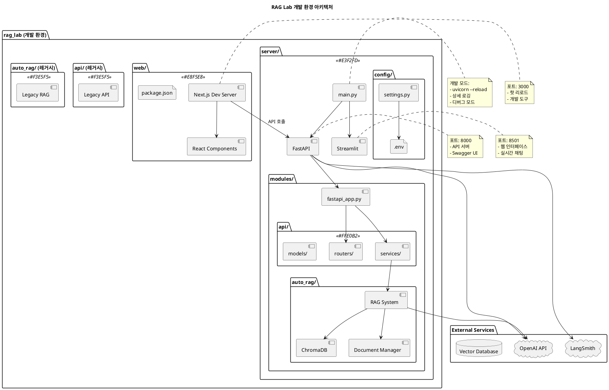
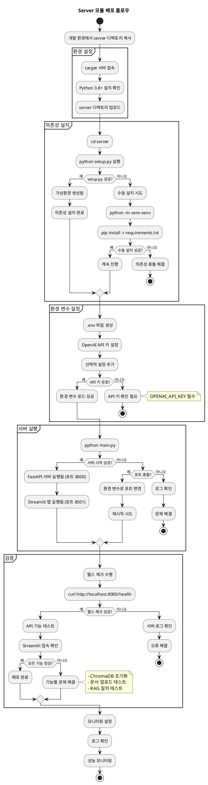
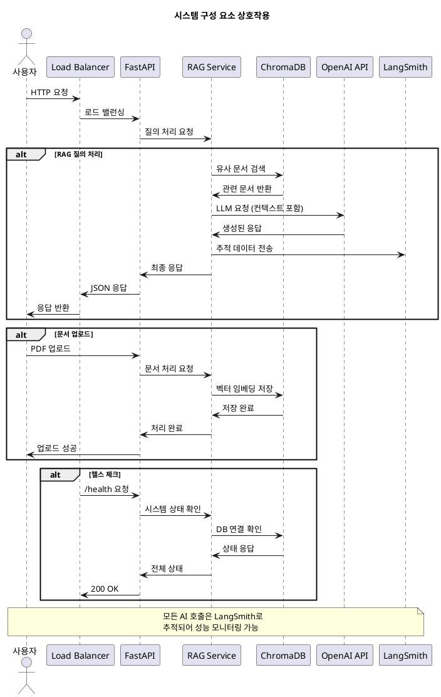
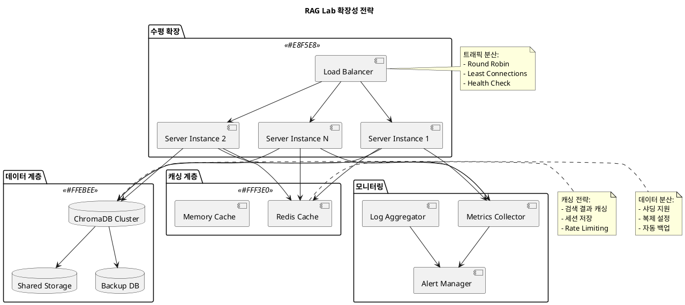

# RAG Lab 아키텍처 다이어그램

이 문서는 RAG Lab 프로젝트의 개발 환경과 배포 환경 아키텍처를 PlantUML 다이어그램으로 설명합니다.

## 🏗️ 개발 환경 구조

### 전체 시스템 아키텍처



### 서버 모듈 상세 구조

```plantuml
@startuml server_module_detail
!define SERVER_COLOR #E3F2FD
!define API_COLOR #FFE0B2
!define RAG_COLOR #E8F5E8
!define CONFIG_COLOR #FFEBEE

title Server 모듈 상세 구조

package "server/" <<SERVER_COLOR>> {
  
  component "main.py" as main {
    - 서버 통합 실행
    - 프로세스 관리
    - 헬스 체크
  }
  
  package "modules/" {
    component "fastapi_app.py" as app {
      - FastAPI 앱 팩토리
      - 미들웨어 설정
      - CORS 구성
    }
    
    package "api/" <<API_COLOR>> {
      package "routers/" {
        component "rag.py" as rag_router
        component "documents.py" as doc_router
      }
      
      package "services/" {
        component "rag_service.py" as rag_service
        component "document_service.py" as doc_service
      }
      
      package "models/" {
        component "rag.py" as rag_models
        component "document.py" as doc_models
      }
    }
    
    package "auto_rag/" <<RAG_COLOR>> {
      component "rag_streamlit_v2.py" as streamlit_app
      
      package "mod/" {
        component "rag_system_manager.py" as rag_mgr
        component "chroma_db_manager.py" as chroma_mgr
        component "langsmith_monitor.py" as langsmith_mgr
      }
      
      folder "chroma_db/" as chroma_folder
      folder "raw_data/" as data_folder
    }
  }
  
  package "config/" <<CONFIG_COLOR>> {
    component "settings.py" as settings {
      - 환경 변수 관리
      - 앱 설정
      - 경로 관리
    }
    file ".env" as env_file
  }
  
  folder "logs/" as logs_folder
  folder "tests/" as tests_folder
  file "requirements.txt" as requirements
  file "setup.py" as setup
}

' Internal connections
main --> app
app --> rag_router
app --> doc_router
rag_router --> rag_service
doc_router --> doc_service
rag_service --> rag_mgr
doc_service --> chroma_mgr
rag_mgr --> chroma_folder
chroma_mgr --> chroma_folder
main --> streamlit_app
settings --> env_file

' External connections  
rag_mgr --> "OpenAI API" : "LLM 호출"
langsmith_mgr --> "LangSmith" : "추적 데이터"

note top of main
  통합 실행 파일:
  - FastAPI + Streamlit 동시 실행
  - 프로세스 모니터링
  - 자동 재시작
end note

note right of rag_mgr
  핵심 RAG 로직:
  - 문서 임베딩
  - 벡터 검색  
  - 응답 생성
end note

@enduml
```

## 🚀 배포 환경 구조

### 서버 전용 배포 아키텍처

```plantuml
@startuml production_architecture
!define PROD_COLOR #E8F5E8
!define API_COLOR #FFE0B2
!define DB_COLOR #FFEBEE
!define MONITOR_COLOR #F3E5F5

title RAG Lab 프로덕션 배포 아키텍처

package "Production Server" <<PROD_COLOR>> {
  
  package "server/" {
    component "main.py" as prod_main {
      - 프로덕션 모드
      - 리로드 비활성화
      - 로그 파일 저장
    }
    
    component "FastAPI" as prod_fastapi {
      포트: 8000
      - API 서버
      - 보안 강화 CORS
      - 성능 최적화
    }
    
    component "Streamlit" as prod_streamlit {
      포트: 8501  
      - 웹 인터페이스
      - 프로덕션 설정
    }
    
    package "modules/" {
      component "RAG System" as prod_rag
      component "Document Manager" as prod_docs
    }
    
    database "ChromaDB" as prod_chroma <<DB_COLOR>> {
      - 벡터 데이터베이스
      - 문서 임베딩 저장
      - 검색 인덱스
    }
    
    folder "raw_data/" as prod_data {
      - 업로드된 PDF
      - 원본 문서
    }
    
    folder "logs/" as prod_logs {
      - server.log
      - error.log
      - access.log
    }
    
    file ".env" as prod_env {
      프로덕션 환경 변수
      - API 키
      - 포트 설정
      - 보안 설정
    }
  }
}

package "External Services" {
  cloud "OpenAI API" as prod_openai
  cloud "LangSmith" as prod_langsmith
  component "Load Balancer" as lb
  component "Reverse Proxy" as proxy
}

package "Monitoring" <<MONITOR_COLOR>> {
  component "Log Monitoring" as log_monitor
  component "Performance Monitor" as perf_monitor
  component "Health Check" as health_check
}

' Connections
lb --> proxy
proxy --> prod_fastapi
proxy --> prod_streamlit

prod_main --> prod_fastapi
prod_main --> prod_streamlit
prod_fastapi --> prod_rag
prod_rag --> prod_chroma
prod_rag --> prod_data
prod_rag --> prod_openai
prod_fastapi --> prod_langsmith

prod_main --> prod_logs
log_monitor --> prod_logs
perf_monitor --> prod_fastapi
health_check --> prod_fastapi

note right of lb
  선택적 구성 요소:
  - 고가용성 필요시
  - 다중 인스턴스
end note

note right of prod_main
  프로덕션 설정:
  - DEBUG=false
  - UVICORN_RELOAD=false
  - LOG_LEVEL=WARNING
  - 성능 모니터링
end note

note bottom of prod_chroma
  지속성 데이터:
  - 백업 필요
  - 정기 유지보수
end note

@enduml
```

### 배포 플로우 다이어그램



### 시스템 상호작용 다이어그램



## 📊 성능 및 확장성 다이어그램

### 확장성 전략



이러한 다이어그램들을 통해 RAG Lab의 아키텍처를 명확히 이해하고, 개발 환경에서 프로덕션 환경으로의 전환을 원활하게 수행할 수 있습니다.